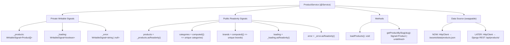

# Products & Solutions Catalog — Implementation Plan (Final)

> All open questions have been resolved. This plan is ready for approval.

---

## Background & Goal

Build a professional, SSR-optimized **Products & Solutions Catalog** for Sunrise Communication — a B2B/B2C lead-generation catalog (not e-commerce). The catalog showcases hardware products (CCTV, EPABX, Biometrics) alongside the services offered (Sales, Installation, AMC, Repair), driving leads through a dynamic WhatsApp CTA.

---

## Workspace Analysis Summary

| Aspect | Current State |
|---|---|
| **Framework** | Angular v22 with Standalone Components |
| **SSR** | Already configured — `@angular/ssr`, Express server, `outputMode: "server"`, `RenderMode.Server` for all routes |
| **Styling** | SCSS per-component + global Bootstrap/custom CSS (`style.css`, `responsive.css`), Google Fonts (Poppins, DM Sans, Jost, Montserrat, Roboto, Sen) |
| **State** | Angular Signals already in use (see [header.component.ts](file:///c:/All%20Files/Code/Sunrise%20Communication/Github-repo/Sunrise-Communication/sunrise-angular/src/app/shared/components/header/header.component.ts)) |
| **SEO** | Existing [SeoService](file:///c:/All%20Files/Code/Sunrise%20Communication/Github-repo/Sunrise-Communication/sunrise-angular/src/app/core/services/seo.service.ts) with `Title`, `Meta`, OpenGraph, Twitter cards, and JSON-LD structured data |
| **Constants** | [site-data.ts](file:///c:/All%20Files/Code/Sunrise%20Communication/Github-repo/Sunrise-Communication/sunrise-angular/src/app/core/constants/site-data.ts) with WhatsApp number (`919323848622`), company info |
| **Routing** | Lazy-loaded via `loadComponent`, route-level `title` property |
| **Best Practices** | Documented in [best-practices.md](file:///c:/All%20Files/Code/Sunrise%20Communication/Github-repo/Sunrise-Communication/best-practices.md) — no `standalone: true` (default), no explicit `OnPush` (default), use `input()`/`output()` functions, `inject()`, native control flow, `NgOptimizedImage`, `@Service` decorator for new singletons |
| **Shared Components** | `PageTitleComponent` (breadcrumb banner), `HeaderComponent`, `FooterComponent`, `PreloaderComponent`, `ScrollToTopComponent` |

---

## Resolved Design Decisions

| Decision | Resolution |
|---|---|
| **WhatsApp Number** | Confirmed: `919323848622` from `site-data.ts` |
| **Product Images** | No AI-generated or placeholder image files. CSS-generated visual placeholders (gradient + category icon + brand text) until real images are provided. |
| **Brand Logos** | `brand_logo_url` field added to interface. Same CSS placeholder approach until real logos are provided. |
| **Header Navigation** | "Products" link added between "About" and "Services" |
| **Price Display** | No price field in data model. WhatsApp CTA is the inquiry mechanism. |
| **Filter State in URL** | Persisted in URL query params (`/products?category=cctv&brand=cp-plus`) for shareability and SEO |
| **Breadcrumb Depth** | Full depth: `Home → Products → CCTV → CP Plus 4MP Dome Camera` |
| **Service Decorator** | Use `@Service` decorator (Angular v22+) for new services. Migrate existing `SeoService` from `@Injectable({providedIn: 'root'})` to `@Service` for consistency. |

---

## Proposed Folder Structure

```
src/app/
├── core/
│   ├── constants/
│   │   ├── seo-data.ts              ← [MODIFY] Add product page SEO entries
│   │   └── site-data.ts             ← [EXISTING] WhatsApp number source
│   ├── models/
│   │   └── product.model.ts         ← [NEW] Product TypeScript interface
│   └── services/
│       ├── seo.service.ts           ← [MODIFY] Add updateForProduct(), migrate to @Service
│       └── product.service.ts       ← [NEW] Product data service with @Service
├── pages/
│   └── products/
│       ├── product-catalog/
│       │   ├── product-catalog.component.ts     ← [NEW] Catalog page
│       │   ├── product-catalog.component.html   ← [NEW] Catalog template
│       │   └── product-catalog.component.scss   ← [NEW] Catalog styles
│       ├── product-detail/
│       │   ├── product-detail.component.ts      ← [NEW] Detail page
│       │   ├── product-detail.component.html    ← [NEW] Detail template
│       │   └── product-detail.component.scss    ← [NEW] Detail styles
│       └── products.routes.ts                   ← [NEW] Child routes
├── shared/
│   └── components/
│       ├── header/
│       │   └── header.component.html            ← [MODIFY] Add "Products" nav link
│       └── product-card/
│           ├── product-card.component.ts        ← [NEW] Reusable product card
│           └── product-card.component.scss      ← [NEW] Card styles
└── app.routes.ts                                ← [MODIFY] Add products route

src/assets/
└── data/
    └── products.json                            ← [NEW] Mock product data

public/
└── sitemap.xml                                  ← [MODIFY] Add products URLs
```

---

## 1. TypeScript Interface — `product.model.ts`

#### [NEW] [product.model.ts](file:///c:/All%20Files/Code/Sunrise%20Communication/Github-repo/Sunrise-Communication/sunrise-angular/src/app/core/models/product.model.ts)

```typescript
/** Represents a key-value technical specification */
export interface ProductSpec {
  key: string;    // e.g., "Resolution", "IR Range", "Channels"
  value: string;  // e.g., "4MP", "30m", "32"
}

/** Service types offered with the product */
export type ServiceType = 'Sales' | 'Installation' | 'AMC' | 'Repair';

/** Core product data interface — mirrors future Django REST API response */
export interface Product {
  id: string;
  slug: string;
  name: string;
  brand: string;
  brand_logo_url: string;       // Path to brand logo — empty string until provided
  category: string;              // Display name: "CCTV", "EPABX", "Biometrics"
  category_slug: string;         // URL-safe: "cctv", "epabx", "biometrics"
  sub_category: string;          // e.g., "Dome Camera", "Analog PBX", "Fingerprint"
  image_url: string;             // Path to product image — empty string until provided
  short_description: string;
  specs: ProductSpec[];
  services_offered: ServiceType[];
}

/** Shape of the JSON asset / API response */
export interface ProductCatalogResponse {
  products: Product[];
}
```

**Design decisions:**
- `specs` uses `ProductSpec[]` (array of key-value) instead of `Record<string, string>` — preserves display order and is easier to iterate with `@for`.
- `ServiceType` is a union literal type — gives compile-time safety and autocompletion.
- `ProductCatalogResponse` wraps the array — matches real API envelope pattern for forward compatibility.
- `category_slug` added as a separate field — keeps display name (`CCTV`) separate from URL segment (`cctv`), avoids runtime transformations.
- `brand_logo_url` and `image_url` can be empty strings — the template handles this with CSS placeholders.

---

## 2. ProductService — Signal-Based, Backend-Ready

#### [NEW] [product.service.ts](file:///c:/All%20Files/Code/Sunrise%20Communication/Github-repo/Sunrise-Communication/sunrise-angular/src/app/core/services/product.service.ts)

**Architecture:**



**Implementation approach:**

1. Uses `@Service` decorator (Angular v22+ best practice) instead of `@Injectable({providedIn: 'root'})`.
2. **`HttpClient`** fetches from `/assets/data/products.json` (same `HttpClient` call that will later point to Django REST).
3. Private writable signals (`_products`, `_loading`, `_error`) hold state.
4. Public `readonly` signals expose state immutably.
5. `computed()` signals derive `categories()` and `brands()` for the filter panel — auto-update when `_products` changes.
6. `getProductBySlug(slug: string)` returns a `computed()` signal that finds the product — reactive and SSR-safe.
7. **Backend swap**: When the Django API is ready, the only change is the URL string (or inject an `API_BASE_URL` token via environment).

**Why HttpClient and not `fetch()`:**
- `provideHttpClient(withFetch())` is the Angular v22 standard — SSR transfer state works automatically.
- The existing `app.config.ts` doesn't have `provideHttpClient()` yet — I will add it.

---

## 3. Routing Strategy

#### [MODIFY] [app.routes.ts](file:///c:/All%20Files/Code/Sunrise%20Communication/Github-repo/Sunrise-Communication/sunrise-angular/src/app/app.routes.ts)

Add a lazy-loaded parent route for products (inserted before the `**` wildcard):

```typescript
{
  path: 'products',
  loadChildren: () => import('./pages/products/products.routes').then(m => m.PRODUCT_ROUTES)
}
```

#### [NEW] [products.routes.ts](file:///c:/All%20Files/Code/Sunrise%20Communication/Github-repo/Sunrise-Communication/sunrise-angular/src/app/pages/products/products.routes.ts)

```typescript
export const PRODUCT_ROUTES: Routes = [
  {
    path: '',
    loadComponent: () => import('./product-catalog/product-catalog.component')
      .then(m => m.ProductCatalogComponent),
    title: 'Products & Solutions Catalog | Sunrise Communication'
  },
  {
    path: ':category/:slug',
    loadComponent: () => import('./product-detail/product-detail.component')
      .then(m => m.ProductDetailComponent)
    // Title set dynamically in component via SeoService
  }
];
```

**Rationale:**
- `loadChildren` with child routes keeps the products feature fully tree-shaken and lazy-loaded.
- `:category/:slug` URL pattern is SEO-friendly: `/products/cctv/cp-plus-4mp-dual-light-dome-camera`.

#### [MODIFY] [app.routes.server.ts](file:///c:/All%20Files/Code/Sunrise%20Communication/Github-repo/Sunrise-Communication/sunrise-angular/src/app/app.routes.server.ts)

Add explicit server route for product detail pages to ensure SSR renders them:

```typescript
export const serverRoutes: ServerRoute[] = [
  {
    path: 'products/:category/:slug',
    renderMode: RenderMode.Server
  },
  {
    path: '**',
    renderMode: RenderMode.Server
  }
];
```

---

## 4. SEO & Meta Tag Strategy

#### [MODIFY] [seo.service.ts](file:///c:/All%20Files/Code/Sunrise%20Communication/Github-repo/Sunrise-Communication/sunrise-angular/src/app/core/services/seo.service.ts)

**Two changes:**

**A. Migrate from `@Injectable({providedIn: 'root'})` to `@Service` decorator** — aligning with best-practices.md for consistency with the new `ProductService`.

**B. Add a new public method for product-specific SEO:**

```typescript
updateForProduct(product: Product, pageUrl: string): void {
  const title = `${product.name} | ${product.brand} - Sunrise Communication`;
  const description = product.short_description;

  this.titleService.setTitle(title);
  this.metaService.updateTag({ name: 'description', content: description });
  this.metaService.updateTag({ name: 'keywords', content: `${product.name}, ${product.brand}, ${product.category}, ${product.sub_category}, Sunrise Communication, Thane` });

  // Open Graph
  this.metaService.updateTag({ property: 'og:title', content: title });
  this.metaService.updateTag({ property: 'og:description', content: description });
  this.metaService.updateTag({ property: 'og:image', content: product.image_url });
  this.metaService.updateTag({ property: 'og:url', content: pageUrl });
  this.metaService.updateTag({ property: 'og:type', content: 'product' });

  // Twitter
  this.metaService.updateTag({ name: 'twitter:title', content: title });
  this.metaService.updateTag({ name: 'twitter:description', content: description });
  this.metaService.updateTag({ name: 'twitter:image', content: product.image_url });

  // Product structured data (JSON-LD)
  this.injectJsonLd({
    '@context': 'https://schema.org',
    '@type': 'Product',
    name: product.name,
    image: product.image_url,
    description: product.short_description,
    brand: { '@type': 'Brand', name: product.brand },
    offers: {
      '@type': 'Offer',
      availability: 'https://schema.org/InStock',
      seller: { '@type': 'Organization', name: 'Sunrise Communication' }
    }
  });
}
```

The existing `injectJsonLd` method will be made accessible to `updateForProduct()` (currently private — will keep private, called internally).

#### [MODIFY] [seo-data.ts](file:///c:/All%20Files/Code/Sunrise%20Communication/Github-repo/Sunrise-Communication/sunrise-angular/src/app/core/constants/seo-data.ts)

Add catalog page entry:

```typescript
'/products': {
  title: 'Products & Solutions Catalog | CCTV, EPABX, Biometrics - Sunrise Communication',
  description: 'Browse our complete catalog of CCTV cameras, EPABX systems, biometric devices, and more. Sales, installation, and AMC services available across Mumbai, Thane, and Navi Mumbai.',
  keywords: 'CCTV products, EPABX systems, Biometric devices, CP Plus, Hikvision, Matrix, Essl, security products Thane'
}
```

---

## 5. Image & Brand Logo Placeholder Strategy (No AI Images)

Since real product images and brand logos will be provided later, the UI will use **pure CSS-generated placeholders** — no image files needed:

### Product Card & Detail Page Image Placeholder
```
┌──────────────────────────────┐
│                              │
│      ┌──────────────┐        │
│      │  📷  Icon     │        │  Gradient background using
│      └──────────────┘        │  category-specific colors:
│                              │  • CCTV → dark blue/teal
│    [ Category Name ]         │  • EPABX → dark purple/indigo
│    [ Brand Name ]            │  • Biometrics → dark green/emerald
│                              │
└──────────────────────────────┘
```

- Uses a CSS gradient background with a centered category icon (from existing `flaticon` or `icofont` icon set already in the project).
- Brand name text overlay at the bottom.
- When `image_url` is non-empty, the actual `` with `NgOptimizedImage` replaces the placeholder entirely.
- Template logic: `@if (product.image_url) {  } @else { <div class="product-placeholder">...</div> }`

### Brand Logo Placeholder
- When `brand_logo_url` is empty, display the brand name as **styled text** with a subtle badge/pill treatment.
- When `brand_logo_url` is non-empty, show the actual logo ``.

---

## 6. Product Catalog Page Component

#### [NEW] ProductCatalogComponent — `/products`

**Features:**
- **Page Title Banner**: Reuses existing `PageTitleComponent` with breadcrumb `Home → Products`.
- **Filter Panel** (sidebar on desktop, collapsible on mobile):
  - **Search bar**: Text input bound to a `searchQuery` signal.
  - **Category checkboxes**: Derived from `productService.categories()` computed signal.
  - **Brand checkboxes**: Derived from `productService.brands()` computed signal.
  - **Active filter chips**: Show selected filters with "×" clear buttons.
  - **"Clear All" button**: Resets all filters.
- **Product Grid**: Responsive CSS Grid (3 cols desktop, 2 tablet, 1 mobile).
- **Filtered Results**: A `filteredProducts` computed signal combines `searchQuery`, `selectedCategories`, and `selectedBrands` signals.
- **Results count**: "Showing X of Y products".

**Signal state architecture:**

```typescript
searchQuery        = signal<string>('')
selectedCategories = signal<Set<string>>(new Set())
selectedBrands     = signal<Set<string>>(new Set())

filteredProducts   = computed(() => {
  const query = this.searchQuery().toLowerCase();
  const cats  = this.selectedCategories();
  const brands = this.selectedBrands();
  
  return this.productService.products().filter(p => {
    const matchesSearch = !query || 
      p.name.toLowerCase().includes(query) || 
      p.brand.toLowerCase().includes(query) ||
      p.short_description.toLowerCase().includes(query);
    const matchesCat   = cats.size === 0 || cats.has(p.category);
    const matchesBrand = brands.size === 0 || brands.has(p.brand);
    return matchesSearch && matchesCat && matchesBrand;
  });
})
```

**URL Query Params Sync:**

Filters are persisted in URL query parameters for shareability and SEO:

```
/products?category=cctv&brand=cp-plus&q=dome
```

- On component init, read query params from `ActivatedRoute.queryParams` and populate signals.
- On filter change, update URL via `Router.navigate([], { queryParams, queryParamsHandling: 'merge' })` without triggering navigation (replaceUrl).
- This enables sharing filtered catalog links and browser back/forward support.

**Template approach:**
- `@for (product of filteredProducts(); track product.id)` for the product grid.
- `@if (filteredProducts().length === 0)` for empty state with a "No products found" message.
- `@if (productService.loading())` for loading skeleton.

---

## 7. Product Card Component (Shared, Reusable)

#### [NEW] ProductCardComponent

**Input signals:**
- `product = input.required<Product>()`

**Displays:**
- Product image via `NgOptimizedImage` (or CSS placeholder when `image_url` is empty).
- Product name (h3).
- Brand name (styled text badge, or logo image when `brand_logo_url` is provided).
- 2–3 key specs (first 3 from `specs` array).
- "Sales & Installation" badge (derived from `services_offered`).
- `routerLink` to `/products/:category_slug/:slug`.

**Why a shared component?**
- Can be reused on the home page for a "Featured Products" section in the future.
- Encapsulates card styling and behavior.

---

## 8. Product Detail Page Component

#### [NEW] ProductDetailComponent — `/products/:category/:slug`

**Layout (2-column on desktop, stacked on mobile):**

| Left Column (55%) | Right Column (45%) |
|---|---|
| Large product image / CSS placeholder | Product name (h1) |
| | Brand (logo or text badge) |
| | Category & Sub-category breadcrumb context |
| | "Services Available" badges row (Sales, Installation, AMC, Repair) |
| | Specifications table (key-value rows from `specs[]`) |
| | **"Inquire on WhatsApp" CTA button** |

**Breadcrumb (full depth):**
```
Home → Products → CCTV → CP Plus 4MP Dual Light Dome Camera
```
Uses `PageTitleComponent` or a custom breadcrumb within the detail layout.

**SEO Logic:**
- On init, read `:slug` from `ActivatedRoute.params`.
- Fetch product via `productService.getProductBySlug(slug)`.
- Call `seoService.updateForProduct(product, currentUrl)` to set dynamic title, meta description, OG tags, and JSON-LD.

**WhatsApp CTA Logic:**

```typescript
private siteData = SITE_DATA;

whatsappUrl = computed(() => {
  const product = this.product();
  if (!product) return '';
  
  const phoneNumber = this.siteData.social.whatsapp.replace('https://wa.me/', '');
  const currentUrl = this.document.location.href;
  const message = `Hi Sunrise Communication, I'm interested in the ${product.name}. Can I get more details? Link: ${currentUrl}`;
  return `https://wa.me/${phoneNumber}?text=${encodeURIComponent(message)}`;
});
```

- Button: `<a [href]="whatsappUrl()" target="_blank" rel="noopener noreferrer">` — styled as a prominent green WhatsApp-branded CTA.
- `whatsappUrl` is a `computed()` signal that recalculates when the product signal updates.

---

## 9. Mock Data — `products.json`

#### [NEW] [products.json](file:///c:/All%20Files/Code/Sunrise%20Communication/Github-repo/Sunrise-Communication/sunrise-angular/src/assets/data/products.json)

8 realistic products spanning 3 categories:

| # | Name | Brand | Category | Sub-Category |
|---|---|---|---|---|
| 1 | CP Plus 4MP Dual Light Dome Camera | CP Plus | CCTV | Dome Camera |
| 2 | Hikvision 2MP ColorVu Bullet Camera | Hikvision | CCTV | Bullet Camera |
| 3 | CP Plus 8 Channel 4K DVR | CP Plus | CCTV | DVR/NVR |
| 4 | Hikvision 4MP IP PTZ Camera | Hikvision | CCTV | PTZ Camera |
| 5 | Matrix ETERNITY GENX12S EPABX System | Matrix | EPABX | Analog PBX |
| 6 | Matrix SPARSH VP510E IP Phone | Matrix | EPABX | IP Phone |
| 7 | Essl X990 Fingerprint Attendance System | Essl | Biometrics | Fingerprint Terminal |
| 8 | Essl MultiBio 700 Face + Fingerprint Terminal | Essl | Biometrics | Multi-Biometric |

Each will have:
- 5–7 realistic technical specs (e.g., Resolution, IR Range, Compression, Storage, Channels, Ports, Sensor Type)
- Appropriate `services_offered` array
- Proper `slug` and `category_slug` for SEO-friendly URLs
- Empty `image_url` and `brand_logo_url` (to be filled when real images are provided)

---

## 10. Header Navigation Update

#### [MODIFY] [header.component.html](file:///c:/All%20Files/Code/Sunrise%20Communication/Github-repo/Sunrise-Communication/sunrise-angular/src/app/shared/components/header/header.component.html)

Add "Products" link in **all three** navigation instances (desktop, sticky, mobile):

```html
<li routerLinkActive="current"><a routerLink="/products">Products</a></li>
```

Navigation order: `Home → About → Products → Services → Contact Us`

Updated in:
- Desktop main nav (line ~58 area)
- Sticky header nav (line ~104 area)
- Mobile menu nav (line ~139 area)

---

## 11. Sitemap Update

#### [MODIFY] [sitemap.xml](file:///c:/All%20Files/Code/Sunrise%20Communication/Github-repo/Sunrise-Communication/sunrise-angular/public/sitemap.xml)

Add the catalog page URL:

```xml
<url>
  <loc>https://www.sunrisecommunication.in/products</loc>
  <changefreq>weekly</changefreq>
  <priority>0.9</priority>
</url>
```

> [!NOTE]
> Individual product detail pages (`/products/cctv/cp-plus-4mp-...`) will be added to the sitemap later when a build-time sitemap generator is set up with the Django backend, since the slugs are dynamic.

---

## 12. App Config Update

#### [MODIFY] [app.config.ts](file:///c:/All%20Files/Code/Sunrise%20Communication/Github-repo/Sunrise-Communication/sunrise-angular/src/app/app.config.ts)

Add `provideHttpClient(withFetch())` to the providers array:

```typescript
import { provideHttpClient, withFetch } from '@angular/common/http';

export const appConfig: ApplicationConfig = {
  providers: [
    provideBrowserGlobalErrorListeners(),
    provideRouter(routes),
    provideClientHydration(),
    provideHttpClient(withFetch())   // ← NEW: enables ProductService + SSR transfer state
  ]
};
```

---

## Styling Approach

- **SCSS per component** — consistent with existing workspace pattern.
- Leverage existing global CSS classes (`auto-container`, `theme-btn`, `btn-style-one`, `clearfix`) for consistency with the rest of the site.
- New product-specific styles use **CSS custom properties** for easy theming.
- **Color palette** draws from the existing site theme.
- Responsive breakpoints align with existing `responsive.css` patterns.
- AOS (Animate on Scroll) attributes for entrance animations — already initialized globally in [app.ts](file:///c:/All%20Files/Code/Sunrise%20Communication/Github-repo/Sunrise-Communication/sunrise-angular/src/app/app.ts).
- Category-specific gradient colors for CSS placeholders:
  - CCTV → dark blue/teal gradient
  - EPABX → dark purple/indigo gradient
  - Biometrics → dark green/emerald gradient

---

## Complete File Change Summary

### New Files (12)
| File | Purpose |
|---|---|
| `src/app/core/models/product.model.ts` | Product TypeScript interface |
| `src/app/core/services/product.service.ts` | Signal-based data service (`@Service`) |
| `src/app/pages/products/products.routes.ts` | Child routing for products feature |
| `src/app/pages/products/product-catalog/product-catalog.component.ts` | Catalog page component |
| `src/app/pages/products/product-catalog/product-catalog.component.html` | Catalog template |
| `src/app/pages/products/product-catalog/product-catalog.component.scss` | Catalog styles |
| `src/app/pages/products/product-detail/product-detail.component.ts` | Detail page component |
| `src/app/pages/products/product-detail/product-detail.component.html` | Detail template |
| `src/app/pages/products/product-detail/product-detail.component.scss` | Detail styles |
| `src/app/shared/components/product-card/product-card.component.ts` | Reusable product card |
| `src/app/shared/components/product-card/product-card.component.scss` | Card styles |
| `src/assets/data/products.json` | Mock product data (8 products) |

### Modified Files (7)
| File | Change |
|---|---|
| `src/app/app.config.ts` | Add `provideHttpClient(withFetch())` |
| `src/app/app.routes.ts` | Add products parent route with `loadChildren` |
| `src/app/app.routes.server.ts` | Add products server route for SSR |
| `src/app/core/services/seo.service.ts` | Migrate to `@Service`, add `updateForProduct()` |
| `src/app/core/constants/seo-data.ts` | Add `/products` SEO entry |
| `src/app/shared/components/header/header.component.html` | Add "Products" nav link (3 instances) |
| `public/sitemap.xml` | Add products URL |

---

## Verification Plan

### Build Verification
```bash
cd sunrise-angular && ng build
```
Ensures all TypeScript compiles, no template errors, and SSR bundle generates correctly.

### Dev Server Testing
```bash
cd sunrise-angular && npm run start
```

**Manual checks:**
1. Navigate to `/products` — verify catalog renders with CSS placeholders, filters work, search works
2. Apply filters — verify URL updates to `/products?category=cctv&brand=cp-plus`
3. Share/reload a filtered URL — verify filters are restored from query params
4. Click a product card — verify navigation to `/products/cctv/cp-plus-4mp-dual-light-dome-camera`
5. On detail page — verify breadcrumb shows full depth (`Home → Products → CCTV → Product Name`)
6. On detail page — verify specs table, WhatsApp CTA opens correctly with pre-filled message including current page URL
7. View page source (SSR check) — verify meta tags and JSON-LD are in server-rendered HTML
8. Test responsive layout at mobile/tablet/desktop breakpoints
9. Verify "Products" link appears and works in header navigation (desktop, sticky, and mobile menus)
10. Check browser console for errors

### SSR Verification
```bash
cd sunrise-angular && npm run serve:ssr:sunrise-angular
```
Then `curl http://localhost:4000/products/cctv/cp-plus-4mp-dual-light-dome-camera` and verify:
- HTML contains the product content (not empty shell)
- `<title>` and `<meta>` tags contain product-specific data
- JSON-LD `<script type="application/ld+json">` is present in `<head>` with product schema
